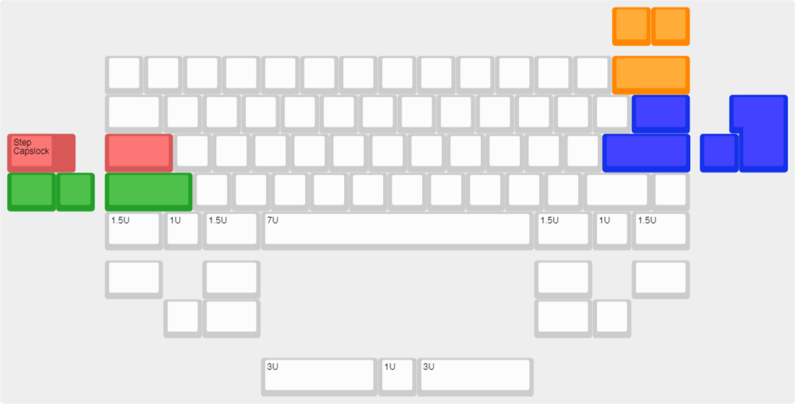
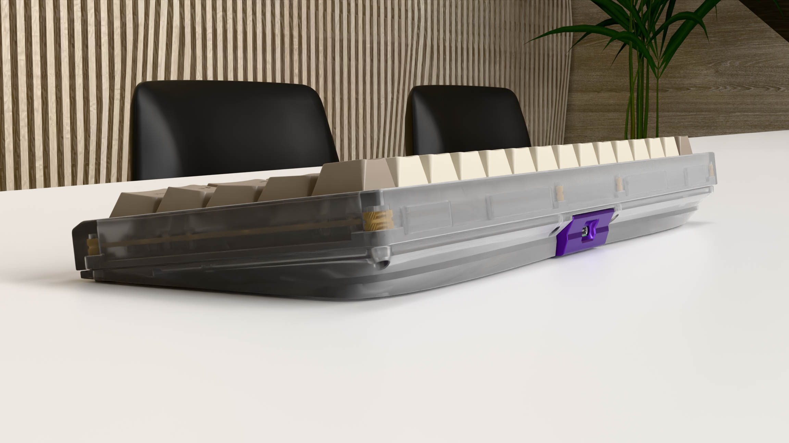
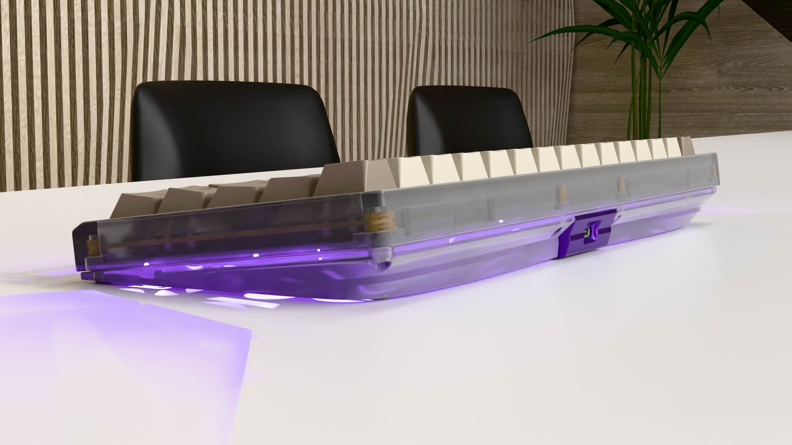
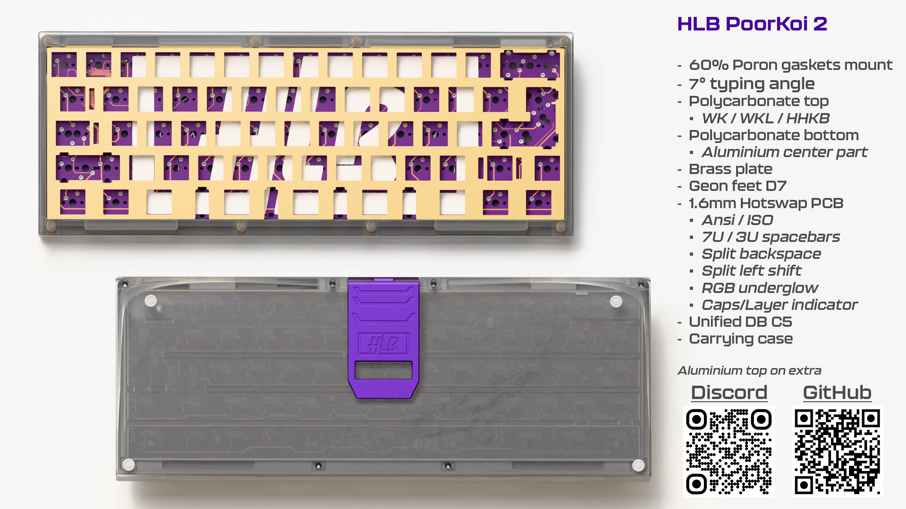
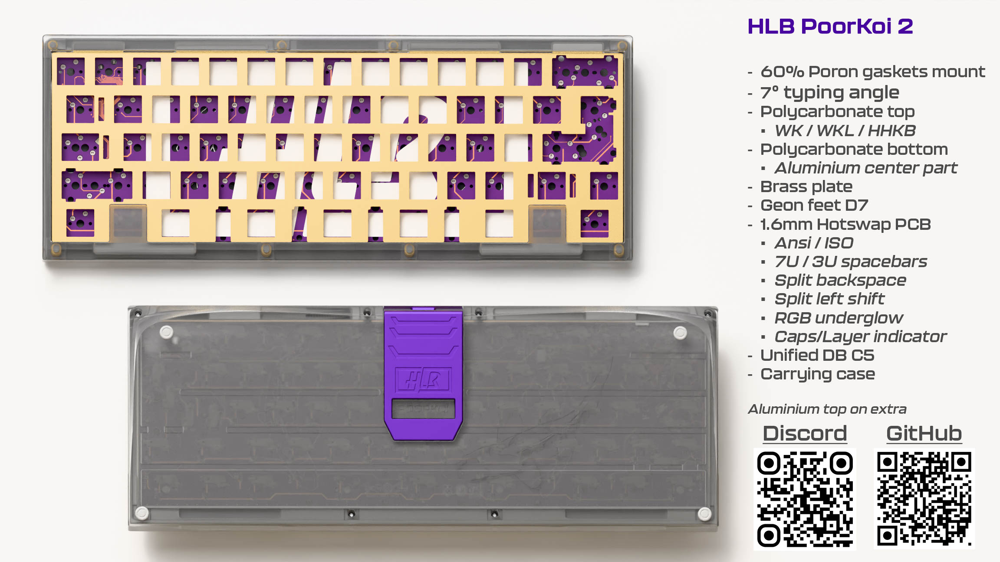
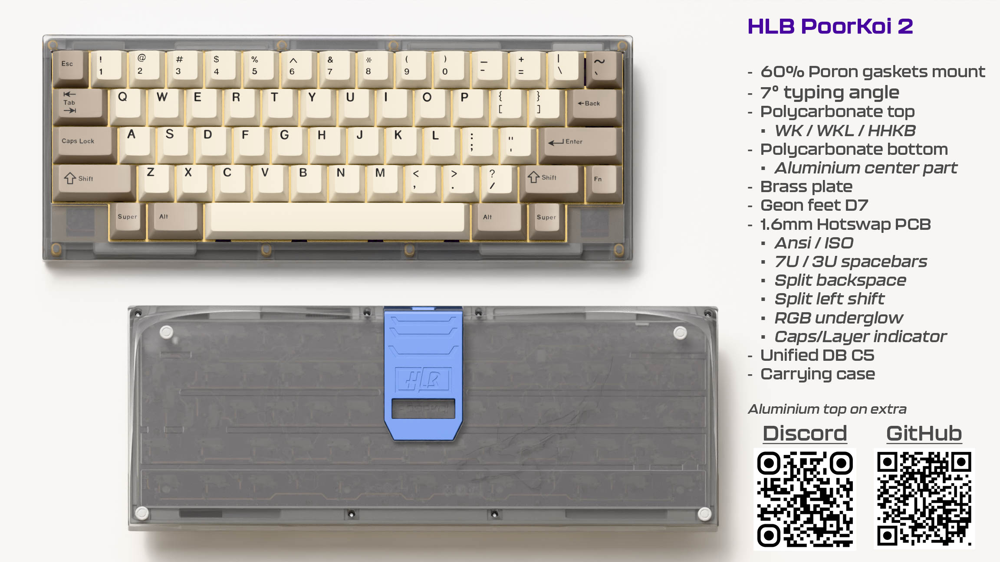

# PoorKoi2

Hi, HLB team Here !

In 2024 we ran our first public group-buy with the PoorKoi 1, an acrylic stacked keyboard. 30 happy users were very surprised by the clack of this simple 60% made with love. This was our first project, mistakes were made, but we learned a lot and we got confident that we could push even further: having the same thing in a cnc'd polycarbonate version!

We are aiming for the same clack and feeling with the polycarbonate version – with an affordable price. No brass weight or copper that are expensive if you don't sell 200 units. Simple design with references of the v1.

We had to make a stand between affordability and customization, that’s why the standard version will be full polycarbonate – but extra aluminium top will be available for purchase during the group-buy.
We were able to order 5 prototypes from a trusty and hight quality manufacturer – DDS while upgrading our game : laser cut Poron gaskets, custom carrying case, in house hotswap pcb (as well as new solder one) !

## Specifications
- 60% Poron gasket mount
- 7° typing angle
- Polycarbonate WK/WKL/HHKB top
- Polycarbonate bottom with central aluminium part
- Brass plate
- Geon feet D7
- 1.6mm HS/Solder PCB
  - RGB underglow
  - Capslock / layers indicator
- Unified DB C5

Without feet:
- 18mm front height
- 23mm EKH

## Compatibility
Same compatibility as v1 with the hotswap pcb

## When and where ?
### When
> First renders => done

> Keyboard prototypes => under production

> PCB prototypes => under production

> GeekHack IC => estimated november 2025

> Group-buy => estimated december 2025 / january 2026

### Where
- EU: DeltaKeyCo.com
- US: TBD
- UK: TBD
- KR: TBD
- CN: TBD

*estimated commercial targets, not final*

## Renders

### Full Polycarbonate - base kit

### Aluminium bottom central colors (aluminium top on extra)

## Prototypes pictures
*Prototypes under production*
## Files
### Plate
Solder PCB supports full length right shift as well as 10U spacebar with 8U stabilizer.
You can find 2 versions, the one from base kit and the one with extended compatibilities, both are compatible with PoorKoi v1

[Standard plate](files/plate_brass.step)

*Extended will be online later*

### Firmware
*Not yet tested - pcb under production*