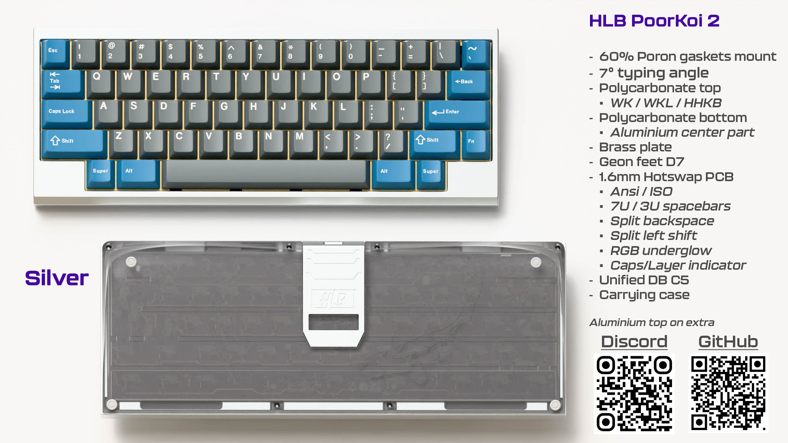
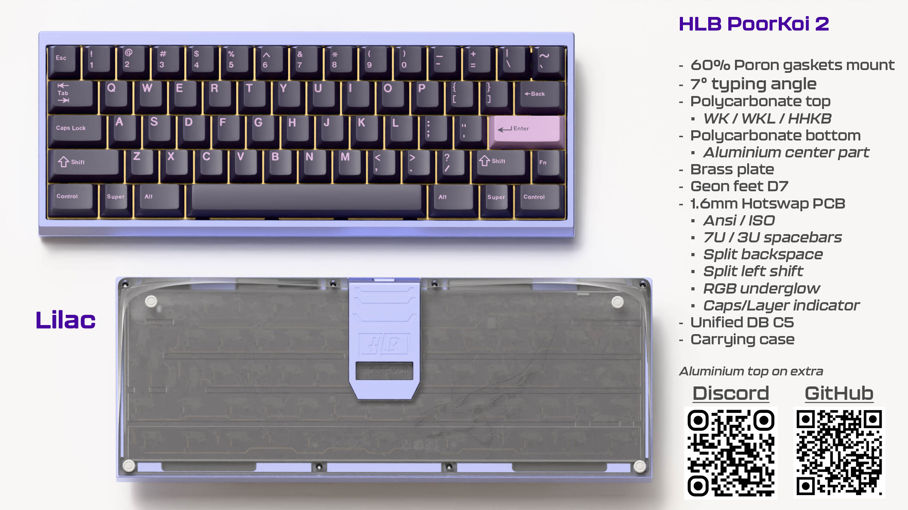

# PoorKoi2

Hi, HLB team Here !

In 2024 we ran our first public group-buy with the PoorKoi 1, an acrylic stacked keyboard. 30 happy users were very surprised by the clack of this simple 60% made with love. This was our first project, mistakes were made, but we learned a lot and we got confident that we could push even further: having the same thing in a cnc'd polycarbonate version!

We are aiming for the same clack and feeling with the polycarbonate version – with an affordable price. No brass weight or copper that are expensive if you don't sell 200 units. Simple design with references of the v1.

We had to make a stand between affordability and customization with a trusty and high quality manufacturer – DDS while upgrading our game : laser cut Poron gaskets, custom carrying case, in house hotswap pcb (as well as new solder one) !

You can find us on [Discord](https://discord.gg/ZV8Ysf6buB)

## Specifications
- 60% Poron gasket mount
- 7° typing angle
- WK/WKL/HHKB
- Polycarbonate bottom with central aluminium part
- Brass plate
- Geon feet D7
- 1.6mm HS/Solder PCB
  - RGB underglow
  - Capslock / layers indicator
- Unified DB C5

Without feet:
- 18mm front height
- 23mm EKH

Weight full built (aluminium top)= 950gr

You can find and share this [PDF Tech view](files/PoorTechView.pdf)

## Compatibility
- Hotswap

- Solder

## Project's status
### When
> First renders => done

> Keyboard prototypes => done

> PCB prototypes => done

> GeekHack IC => estimated december 2025

> Group-buy => estimated january 2026

### Where
- EU: DeltaKeyCo.com
- US: TBD
- UK: TBD
- KR: TBD
- CN: TBD

*estimated commercial targets, not final*

### Changelog
- HLB60 is now our standard pcb and koï fishes are removed from the back
- Polycarbonate bottom will have 2 koï fishes like the carrying case

### Colors

### Polycarbonate top render with WK layout

## Media
All prototypes made by DDS with pictures and sound test / reviews are listed on the dedicated web page here :

## Files
### Build Guide
You can find a simple build guide PDF [Build Guide v1](files/PoorKoi2_Build_Guide.pdf)

### Plate
Solder PCB supports full length right shift as well as 10U spacebar with 8U stabilizer.
You can find 2 versions, the one from base kit and the one with extended compatibilities, both are compatible with PoorKoi v1

[Standard plate](files/plate_brass.step)

*Extended will be online later*

### Firmware
You can find documentation and firmware on the dedicated page [HLB60 doc](https://github.com/H3lli0n/HLB-Projects?tab=readme-ov-file#hlb60)