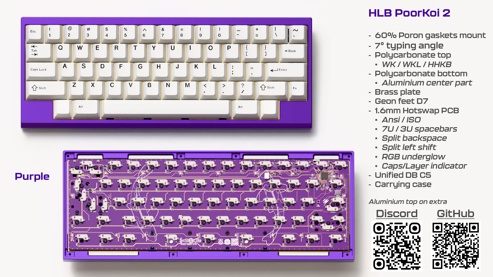
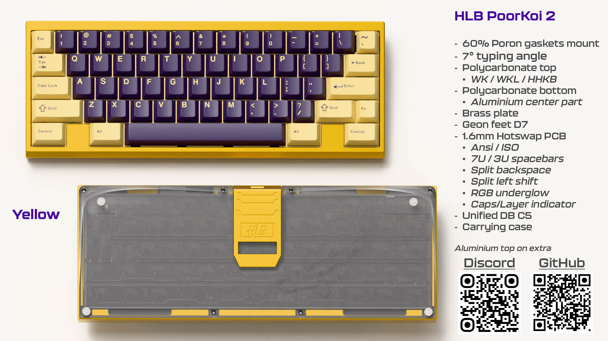

# PoorKoi2

In 2024 we ran our first public group-buy with the PoorKoi 1, an acrylic stacked keyboard.
30 happy users were very surprised by the clack of this simple 60% we made with love. Yes we made some mistakes but from this first version something was slowly growing in our mind: having the same thing in a cnc'd polycarbonate version !

In 2025 we are proud to show you the PoorKoi 2, the cnc'd version with all we've learned from the v1 as well as the Hyperbolas TKL project we've designed. We decided to change projects timeline and put this 60% keyboard in front for 2025. But why? (PoorKoi pronounced in french is "Pourquoi" meaning "why" - yeah we are funny!)

- Aiming an affordable price !
- No brass weight or copper that are expensive
- Popular and compact format

From all those economic reasons we were able to order 5 prototypes from a well known manufacturer(yeah you know it starting with a "D"!) and we upgraded our game: laser cut Poron gaskets, custom carrying case, in house hotswap pcb (as well as new solder one) !

## Specifications
- 60% Poron gasket mount
- 7° typing angle
- Polycarbonate WK/WKL/HHKB top
- Polycarbonate bottom with central aluminium part
- Brass plate
- Geon feet D7
- 1.6mm HS/Solder PCB
- Unified DB C5

## Compatibility
Same compatibility as v1 with the hotswap pcb

## Renders
### Full Polycarbonate - base kit

### Aluminium bottom central colors (aluminium top on extra)

## Prototypes pictures
*Prototypes under production*
## Files
### Plate
Solder PCB supports full length right shift as well as 10U spacebar with 8U stabilizer.
You can find 2 versions, the one from base kit and the one with extended compatibilities
### Firmware
*Not yet tested - pcb under production*